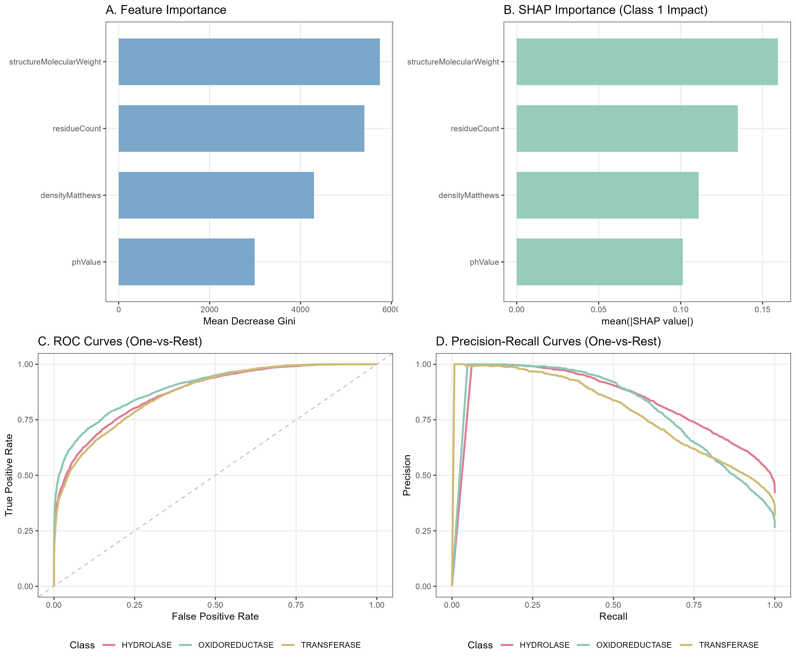

# BioPredProtein: Protein Functional Classification Predictor

---


## Overview

BioPredProtein is a specialized bioinformatics R package designed to predict the functional classification of protein structures based on their fundamental physicochemical properties.

This tool utilizes a pre-trained Random Forest machine learning model to classify proteins into three major enzyme classes:

- **Hydrolase**
- **Transferase**
- **Oxidoreductase**

The prediction relies on four core features derived from the Protein Data Bank (PDB):
1. Structure Molecular Weight
2. Residue Count
3. Matthews Density
4. pH Value

---


## Installation

You can install the development version of BioPredProtein from GitHub:

```r
# install.packages("devtools")
devtools::install_github("HanYan-xjtlu/BIO215_Project_R_Package")
```

---


## Usage Example

The main function of this package is `predict_protein_class()`, which can be used with the included sample data or your own input.

### 1. Load the Package

```r
library(BioPredProtein)
```

### 2. Predict Using Internal Example Data

The package includes a validation dataset stored in `inst/extdata/`.

```r
# Locate the internal test file
example_path <- system.file("extdata", "test_data_sample.csv", package = "BioPredProtein")

# Load data
test_data <- read.csv(example_path)

# Perform prediction
predictions <- predict_protein_class(test_data)

# View the first few results
head(predictions)
```

### 3. Predict Using Manual Input

You can also create a data frame with your own values:

```r
# Create a data frame with the required 4 features
my_protein <- data.frame(
  structureMolecularWeight = c(35000, 120000),
  residueCount = c(320, 950),
  densityMatthews = c(2.4, 2.1),
  phValue = c(7.2, 6.0)
)

# Perform prediction
result <- predict_protein_class(my_protein)
print(result)
```

---


## Model Performance

The internal Random Forest model was trained and validated on a curated PDB dataset. The figure below demonstrates the model's reliability using Receiver Operating Characteristic (ROC) and Precision-Recall (PRC) curves.




---


## Contributors

`T.B.D.`
